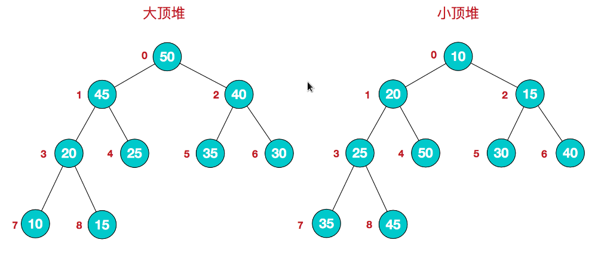
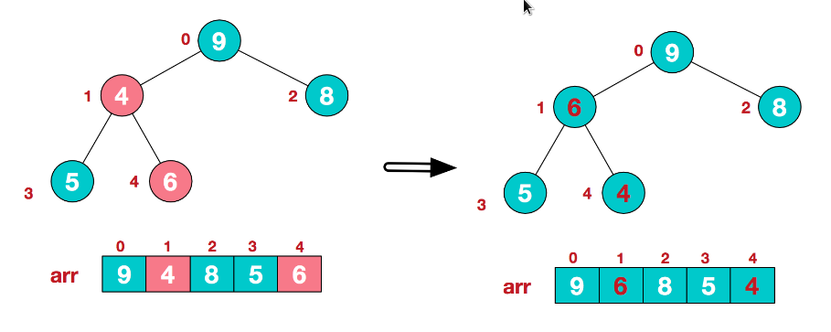
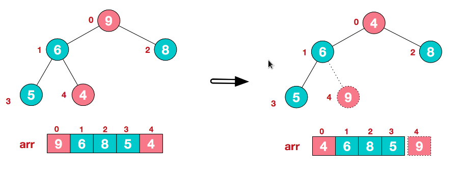
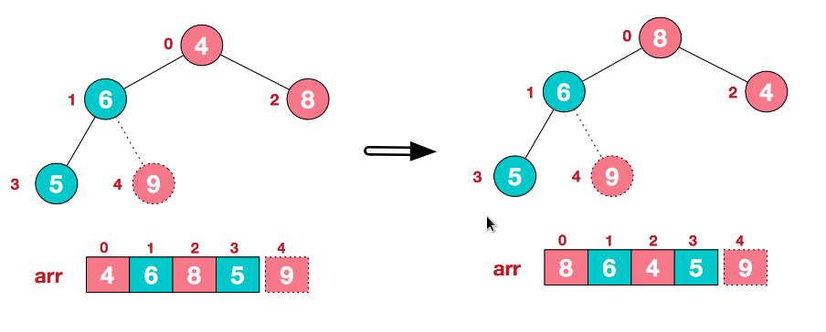
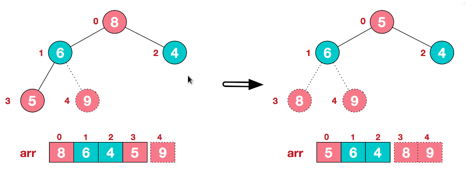
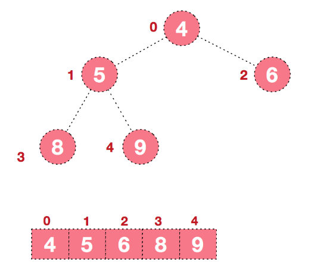

# 堆排序

堆排序是利用堆这种数据结构而设计的一种排序算法，堆排序是一种选择排序，它的最坏，最好，平均时间复杂度均为O(nlogn)，它也是不稳定排序。首先简单了解下堆结构。

堆是具有以下性质的完全二叉树：每个结点的值都大于或等于其左右孩子结点的值，称为大顶堆；或者每个结点的值都小于或等于其左右孩子结点的值，称为小顶堆。如下图：

同时，我们对堆中的结点按层进行编号，将这种逻辑结构映射到数组中就是下面这个样子

该数组从逻辑上讲就是一个堆结构，我们用简单的公式来描述一下堆的定义就是：

大顶堆：arr[i] >= arr[2i+1] && arr[i] >= arr[2i+2]  

小顶堆：arr[i] <= arr[2i+1] && arr[i] <= arr[2i+2]  

## 堆排序的基本思想和步骤

堆排序的基本思想是：将待排序序列构造成一个大顶堆，此时，整个序列的最大值就是堆顶的根节点。将其与末尾元素进行交换，此时末尾就为最大值。然后将剩余n-1个元素重新构造成一个堆，这样会得到n个元素的次小值。如此反复执行，便能得到一个有序序列了

步骤一：构造初始堆。将给定无序序列构造成一个大顶堆（一般升序采用大顶堆，降序采用小顶堆)。

假设给定无序序列结构如下

此时我们从最后一个非叶子结点开始（叶结点自然不用调整，第一个非叶子结点 arr.length/2-1=5/2-1=1，也就是下面的6结点），从左至右，从下至上进行调整

找到第二个非叶节点4，由于[4,9,8]中9元素最大，4和9交换。

这时，交换导致了子根[4,5,6]结构混乱，继续调整，[4,5,6]中6最大，交换4和6。

此时，我们就将一个无需序列构造成了一个大顶堆。

步骤二：将堆顶元素与末尾元素进行交换，使末尾元素最大。然后继续调整堆，再将堆顶元素与末尾元素交换，得到第二大元素。如此反复进行交换、重建、交换。

将堆顶元素9和末尾元素4进行交换

重新调整结构，使其继续满足堆定义

再将堆顶元素8与末尾元素5进行交换，得到第二大元素8.

后续过程，继续进行调整，交换，如此反复进行，最终使得整个序列有序

再简单总结下堆排序的基本思路：

- 将无需序列构建成一个堆，根据升序降序需求选择大顶堆或小顶堆;

- 将堆顶元素与末尾元素交换，将最大元素"沉"到数组末端;

- 重新调整结构，使其满足堆定义，然后继续交换堆顶元素与当前末尾元素，反复执行调整+交换步骤，直到整个序列有序。

堆排序是一种选择排序，是不稳定排序，整体主要由构建初始堆+交换堆顶元素和末尾元素并重建堆两部分组成。其中构建初始堆经推导复杂度为O(n)，在交换并重建堆的过程中，需交换n-1次，而重建堆的过程中，根据完全二叉树的性质，[log2(n-1),log2(n-2)...1]逐步递减，近似为nlogn。所以堆排序时间复杂度一般认为就是O(nlogn)级。
